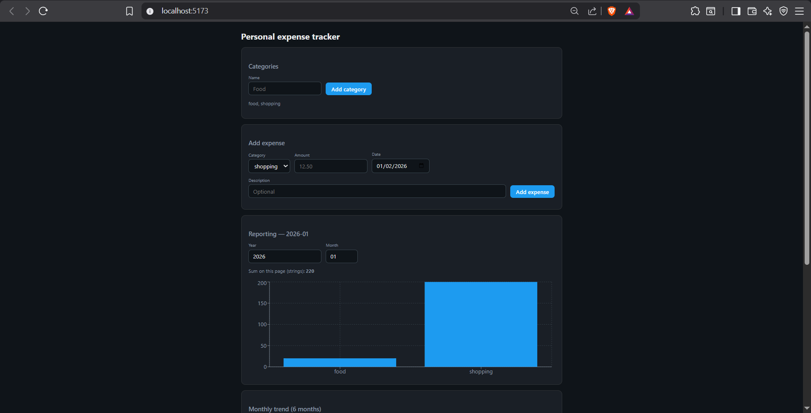
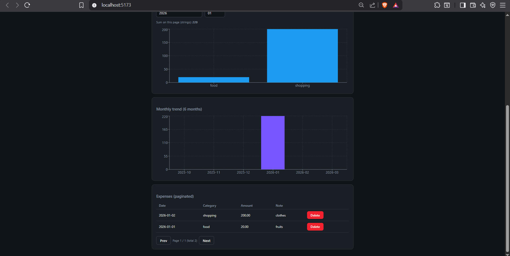

## Backend Fixes (app.py, models.py)

1. 	offset = page * per_page - was skipping page 1 entirely (due to offset 10)

2.	Added filter(Expense.is_deleted == 0) to list_expenses + total count

3.	Amount stored as string	Changed: db.String(32) to db.Numeric(12, 2) {string -> float} in models.py

4.	Added positive number validation for 'amount' with clear error messages

## Frontend Fixes (App.jsx)

1. 	Changed data.monthly_series to data.trend_rows with period/spend keys (incorrect backend api response)

2.	Changed dataKey="value" to dataKey="amt" to match API

3.	Number(e.amount || 0) use positive integer instead of string addition

4.	Added try catch + error display to loadCategories

=======
## Backend Fixes (app.py, models.py)

1. 	offset = page * per_page - was skipping page 1 entirely (due to offset 10)

2.	Added filter(Expense.is_deleted == 0) to list_expenses + total count

3.	Amount stored as string	Changed: db.String(32) to db.Numeric(12, 2) {string -> float} in models.py

4.	Added positive number validation for 'amount' with clear error messages

## Frontend Fixes (App.jsx)

1. 	Changed data.monthly_series to data.trend_rows with period/spend keys (incorrect backend api response)

2.	Changed dataKey="value" to dataKey="amt" to match API

3.	Number(e.amount || 0) use positive integer instead of string addition

4.	Added try catch + error display to loadCategories

